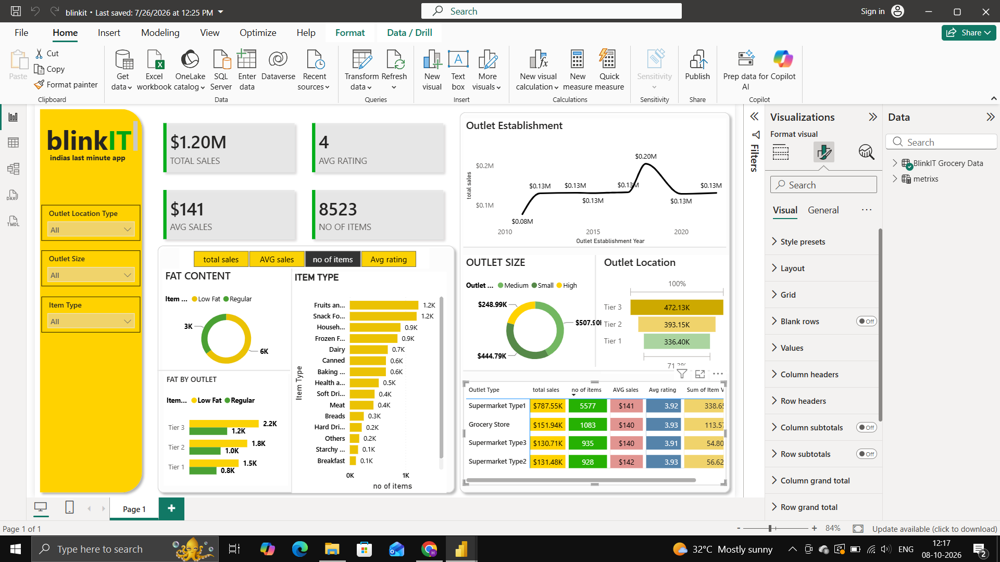

# Blinkit Sales & Outlet Performance Analysis | Power BI

##  Project Overview

This project is an interactive Power BI dashboard created to analyze Blinkit's sales performance, outlet characteristics, item categories, and customer ratings.

The dashboard allows users to explore sales based on outlet location, outlet size, item type, fat content, and outlet establishment year.

##  Project Objectives

- Analyze overall sales performance
- Compare sales across different outlet types
- Analyze sales by outlet location and size
- Understand item category performance
- Analyze low-fat and regular products
- Examine customer ratings
- Create an interactive business dashboard

##  Tools & Technologies

- Power BI
- Power Query
- DAX
- Excel / CSV
- Data Visualization
- Data Analysis

##  Key Metrics

- Total Sales
- Average Sales
- Average Rating
- Number of Items
- Sales by Outlet Type
- Sales by Outlet Location
- Sales by Outlet Size
- Sales by Item Type
- Fat Content Analysis

## Dashboard Preview



##  Dashboard Features

The dashboard includes:

- Interactive filters
- KPI cards
- Sales trend analysis
- Outlet size analysis
- Outlet location analysis
- Fat content analysis
- Item type analysis
- Outlet performance table

## Key Insights

The dashboard helps identify:

- Overall sales performance
- High-performing outlet types
- Sales contribution from different outlet sizes
- Popular item categories
- Distribution of low-fat and regular products
- Differences in outlet performance

## Project Structure

```text
Blinkit-Sales-Analysis-PowerBI/
│
├── README.md
├── Blinkit_Sales_Analysis_PowerBI.pbix
│
└── screenshots/
    └── dashboard.png
